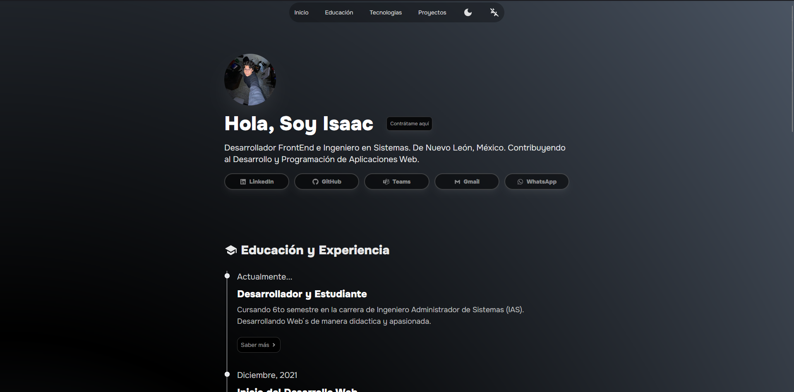
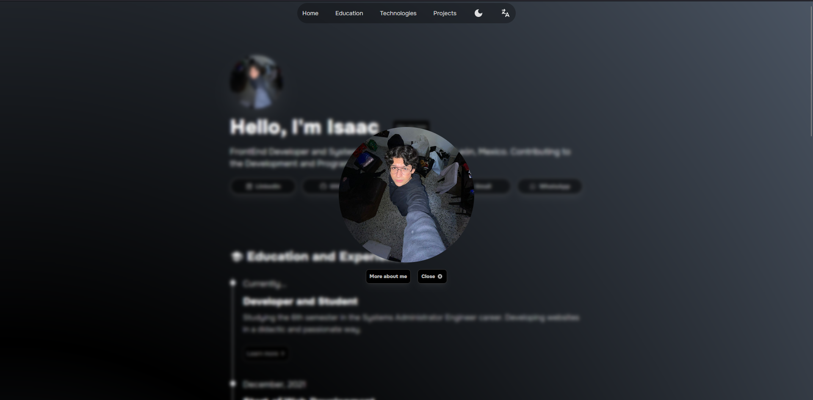
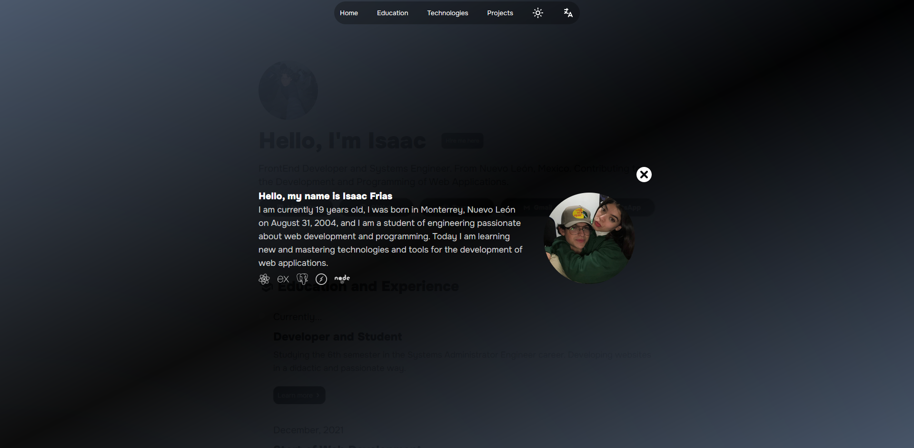

<h3># Project Name</h3>
<h2>This is my official portafolio made with React.js </h2>

## Description

<h3>I made this portfolio to lear how can i get hire for a company</h3>

<h4>This is the introduction of my porfolio</h4>

<h4> I made a dark mode and a language mode that altarnates between english and spanish
also i made an image modal and an about me modal</h4>
 

 

## Table of Contents

- [License](#license)
- [Contact](#contact)

## License

This project is licensed under the [MIT License](LICENSE).

## Contact

(mailto:isaacfrias868@gmail.com).
