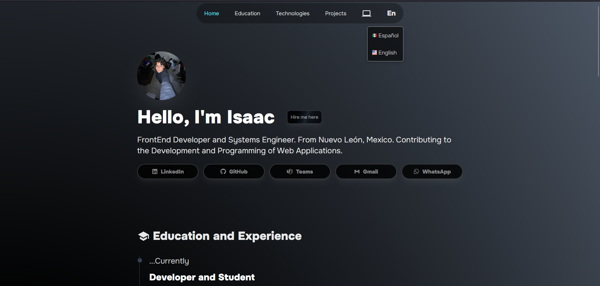

<h3># Project Name</h3>
<h2>This is my official portafolio made with React.js </h2>

## Description

<h3>I made this portfolio to learn how can i get hire for a company</h3>

<h4>This is the introduction of my porfolio</h4>

<h4>I made three differents modes, dark, ligh and System, te most interesting button actually is the buttont System, because 
it detects wich color is the color preferens of the use</h4>

 

<h4>As well i do for a button to choice the language you prefer, is only in Spanish and English wich are my two main languages</h4>

<h4>And the other thing thats is very interesting to see, is my knowledge and my education, i divided it in two diferents sections, my first secion is called "Educationa and Experiencie" and my other section of knowledge is called "Technologies and Tools" </h4>

<h4>My finall section is "Projects" where i show differents projects that i create or collaborated</h4>

 

<h4>A crazy funfact is that if you click on my profile picture on the portfolio you will able to se a modal that show my image more closest</h4>
 

 

<h4>Another funfact is that i include an About Me modal, that describes me a little more specific and</h4>

## Table of Contents
- [License](#license)

- [Contact](#contact)

## License

This project is licensed under the [MIT License](LICENSE).

## Contact

(mailto:isaacfrias868@gmail.com).
